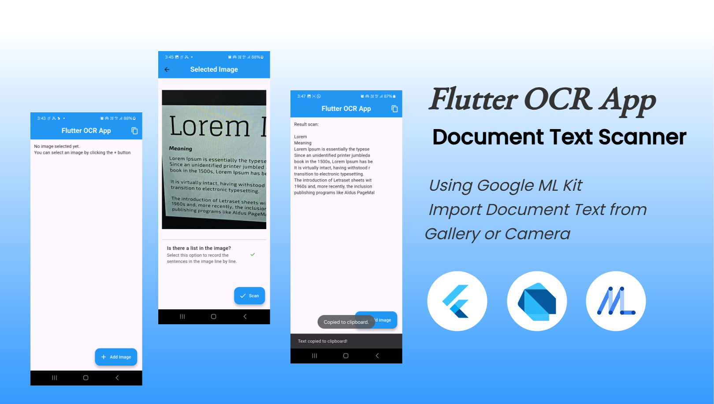

# Flutter OCR App

A project on Flutter OCR App using Google's ML Kit Text Recognition! Scan any printed document and get it into digitised text!

## Documentation
Read the documentation on the [Google ML Kit Text Recognition](https://pub.dev/packages/google_mlkit_text_recognition) to understand how it works!

